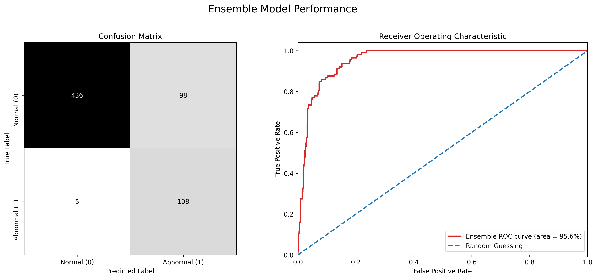

**Sepehr Akbari**
*Nov 10, 2025*
*CSCI 325: AI (Project 2)*

# Heart Sound Classification

Imagine you are going to the doctor for a checkup, given the large number of patients and lay-offed medical staff in the age of AI, different conditions are being screened by AI models, and you are sent to the doctor only if something was flagged by the AI. One of these screenings is to check your heart sounds for abnormalities. In this project, we developed a pipeline to classify heart sounds as normal or abnormal using various machine learning models which would be useful for this given clinic and scenario.

To evaluate our models, we cannot just rely on accuracy. Of course we always want to be correct, but lets say we are in a situation where the model is going to misclassify. Imagine you incorrectly get classified to have a normal heart beat, in this case you will go home while you actually have a heart condition, which can be life-threatening. On the other hand, if you are incorrectly classified to have an abnormal heart beat, you will be called in to see the doctor, and after some tests you will be told that everything is fine. While this is inconvenient and stressful, it is not life-threatening. Therefore, in this scenario, we want to minimize false negatives (i.e., classifying an abnormal heart beat as normal) more than false positives. To capture this requirement in our evaluation metrics, we use Recall of the normal class (class 0) and Precision of the abnormal class (class 1), and combine them using the F2 score, and see the overall performance of our models using the F1 score.

## Summary

| Model                  |   Recall 0 |   Precision 1 |   F1 |   F2 |
|:-----------------------|-----------:|--------------:|-----:|-----:|
| Ensemble               |       95.6 |          81.7 | 67.7 | 82.1 |
| EnhancedResnetTransfer |       92.0 |          84.8 | 69.8 | 81.6 |
| DFFN                   |       92.9 |          83.5 | 68.6 | 81.4 |
| BaselineCNN            |       89.4 |          81.1 | 64.1 | 77.2 |
| EnhancedCNN            |       83.2 |          87.5 | 68.6 | 76.7 |
| MediumCNN              |       95.6 |          69.8 | 56.5 | 74.9 |
| BaselineResnetTransfer |       83.2 |          83.3 | 63.5 | 74.0 |
| AugmentedCNN           |       96.5 |          67.0 | 54.8 | 74.0 |
| EnhancedFNN            |       84.1 |          81.3 | 61.7 | 73.4 |
| BaselineFNN            |       94.7 |          63.9 | 51.8 | 71.1 |
| seCNN                  |       88.5 |          69.1 | 52.9 | 69.7 |
| ccv1_b2                |       73.5 |          75.3 | 50.6 | 62.2 |
| ccv2_b2                |       54.9 |          92.7 | 57.9 | 56.1 |
| ccv2_b3                |       51.3 |          95.1 | 58.9 | 54.1 |
| ccv2_b1                |       65.5 |          67.8 | 41.2 | 53.0 |
| ccv1_b1                |       34.5 |          44.9 | 19.9 | 26.7 |

### Preprocessing & EDA

Our first task in this pipeline is to change the representation of these heart sound signals from sound waves or 1D signals to 2D images. We could of course use the raw signals as input to our models, but using images, especially ones that capture the frequency domain of the signals, would help our models learn better features. We used Mel-spectrograms for this purpose, which uses a Mel scale and Fourier transforms to represent the frequency content of the signals over time. This representation is particularly useful for audio signals as it aligns more closely with human auditory perception.

We also had to fix the length of these signals, and the length of the resulting Mel-spectrograms, as different signals had different lengths. We used padding and truncation to achieve this, padding shorter signals with zeros and truncating longer ones to a fixed length. To confirm this length distributions were observed.

### Classical Computer Vision (CCV) Approach

We observed that the signals are most different in the top-half of the Mel-spectrograms, based on the mean intensity values of normal vs abnormal samples. So for our first approach, we looked at top-half and based on the mean of the normal class, assigned a threshold to classify the samples. This simple method achieved a low score across our metrics, but it was a good baseline to compare against. 

Next we thought about why one would call a heart beat abnormal; one logic is sudden changes or irregularities in the sound pattern. To capture this, we used edge detection methods (Sobel) to extract edges from the Mel-spectrograms, and then we used a threshold like before to classify the samples based on the mean intensity of the edges. This method performed much better than the previous one, showing that even with the same approach, edges are an important aspect of the signals.

We then moved toward a more traditional training of classifiers. We first extracted statistical features like mean, variance, skewness, kurtosis, etc. from the Mel-spectrograms, and trained a non-linear (RBF) SVM classifier on these features. This method did not perform better, meaning that these statistical features were not sufficient to capture the differences between normal and abnormal heart beats.

Next, we wanted to utilize edge features further, so we extracted HOG (Histogram of Oriented Gradients) features from the Mel-spectrograms, which capture edge orientations and distributions. Training a random forest classifier on these features yielded better results, indicating that edge information is indeed valuable for this classification task. However interestingly, this performed worse than our simple edge-thresholding method, suggesting that the random forest classifier was not able to fully leverage the edge information and perhaps suffered from overfitting.

We also decided to try LBP (Local Binary Patterns) features, which capture texture information in images, especially related to texture patterns. We trained a KNN classifier on these features, but the results were not as good as HOG, suggesting that texture information alone is not sufficient for this task.

### Deep Learning Approach

Firstly, to have a fair comparison, we have a single training loop defined which uses early stopping based on validation loss to prevent overfitting with a patience of 10 epochs. The models are trained using the Adam optimizer with a learning rate of 0.0001. The loss function used is Binary Cross-Entropy Loss, using class weights to address class imbalance in the dataset. The input images are normalized in the dataset, and already have a 128x128 size, so no resizing is needed. The models are trained for a maximum of 50 epochs, but most models converge earlier due to early stopping.

To start a more powerful deep learning approach to learn features better, we first started with a simple Feedforward Neural Network (BaselineFNN) on the raw Mel-spectrogram pixel values. This model performed better than our CCV methods, showing that deep learning can learn more complex features from the data, even without sophisticated architectures or learning methods. The model just has a single hidden layer with 128 neurons and ReLU activations. Thats all, so it did not perform that well relative to what is possible. To enhance this model (EnhancedFNN), we kind of went all out despite signs of overfitting to improve learning. The new model now had 3 hidden layers starting with 10% of the input size (1680 neurons) and halving the size at each layer. We did add a 25% dropout layer after each hidden layer to reduce overfitting, but our model was still overfitting but learning much more.

To further improve our models, we of course turned to Convolutional Neural Networks (CNNs), to unlock the power of convolutions for image data and more parameters to learn better features. Our baseline CNN (BaselineCNN) had 2 convolutional layers with max-pooling and ReLU activations, followed by a 128 neuron fully-connected layer. This model performed significantly better than our FNNs, showing the power of CNNs for image data. This was actually one of our best models, since the simplicity of the model helped reduce overfitting while still learning powerful features. Although the recall and precision that we cared about were not that high and not well balanced. Another problem was the extreme overfitting after just a small number of epochs. To better this model (MediumCNN), we aimed to decrease overfitting with adding dropout of 30%, lowering number of neurons in the fully-connected layer, and adding an adaptive average pooling layer before the fully-connected layer to reduce the spatial dimensions. This model had much better generalization, and the recall improved a lot, but the precision dropped significantly, leading to a low F2 score. We then next built another CNN model (EnhancedCNN) with a higher capacity to learn with more output neurons in the average pooling layer. Since this of course increased overfitting, we added more dropout (70%) before the fully-connected layer. This model had a great balance between recall and precision, leading to a high F1 score, but the recall was not as high as we wanted. This model achieved the best balance between recall and precision among our CNNs.

I then tried a very different CNN architecture (seCNN) using Squeeze-and-Excitation blocks to learn features in a more sophisticated way by. The SE blocks help the model focus on more important channels by re-weighting them based on their importance. More detail on how this works can be found in the Jupyter notebook. This model had a very bad performance against my original expectations, since the complexity was high and we found that the features were not generally separable enough to take advantage of this architecture. What I learned from this was that we need different focus scopes to look for different features and based on our EDA, and the results of our edge-based model, global features were more important than channel-wise or fine-grained features. So in the next model (DFFN) I built a Deep Feature Fusion Network that had a block to capture the lower level fine-grained features, and two to capture more global ones, this was controlled by mostly number of feature maps in the convolutional layers but also the average mean pooling. More info on this is also in the Jupyter notebook. This model performed very well, achieving a high recall and precision, and also a relatively high F1 and F2 score! We also tried data augmentation (AugmentedCNN) to increase the diversity of our training data and help reduce overfitting. Detail how about the exact transformations we used on the training set are in the notebook, but overall it included basic rotations and audio shifts to not distort the sounds too much since the difference between classes as we seen in EDA is subtle. This model performed decently, achieving a very high recall but a low precision, leading to a low F1 and F2 score. This shows that while data augmentation can help reduce overfitting and improve recall, it may not always lead to better precision, especially if the augmented data introduces noise or distortions that confuse the model.

As a final approach, we used Transfer Learning with a pre-trained ResNet18 model. Our baseline transfer learning model (BaselineResnetTransfer) simply replaced the classification head with a new one for our binary classification task, and also replaced the first convolutional layer to accept single-channel input images. Also for better fine-tuning I reduced the learning rate by a factor of 10. This model did not perform that well, but the main issue was that we were not fine-tuning the pre-trained layers, so the model was not able to adapt the learned features to our specific task. Therefore, we built an enhanced version (EnhancedResnetTransfer) where we fine-tuned the third and fourth layers of the ResNet model, allowing it to learn more task-specific features. For this model, I also added a weight decay to the optimizer to reduce overfitting. This model performed very well, achieving a high recall and precision, and also a relatively high F1 and F2 score, being one of our best models. 

### Conclusion

Since our different models each had their own strengths and weaknesses, and none of them is a 100% perfect classifier, we decided to build an ensemble model that combines the predictions of our top models to leverage their strengths and mitigate their weaknesses. We selected the top models in different aspects. We picked the EnhancedResnetTransfer, AugmentedCNN, EnhancedCNN, and also the DFFN model since it was very close to the Resnet model and has a different architecture. By combining these models, we can leverage their individual strengths and mitigate their weaknesses, leading to improved overall performance in our classification task. This model had the best overall performance based F1 and F2 metrics and a very good balance of recall and precision. 

The final performance summary of this ensemble model is shown below. So now, when your heart beat is classified by our model pipeline as normal, you can be about 99% confident that there is nothing wrong and go home, if it's classified as abnormal, you should see the doctor about 96% of the time, but about 48% of the time you will be called in for nothing, which is fine.

The learnability from this dataset was low. The data was very limited (3000 samples), extremely imbalanced (about 80-20), and the differences between normal and abnormal samples were very subtle. Also given that this was audio files, our representation choice (Mel-spectrograms) may not have been the best one, and other representations might have been better. Overall, I don't think we can learn it fully, or expect to build a perfect classifier given these limitations, but we were in fact, through a lot of experimentation and trying different approaches, able to build a decent classifier that can be useful for screening heart sounds in a clinical setting.